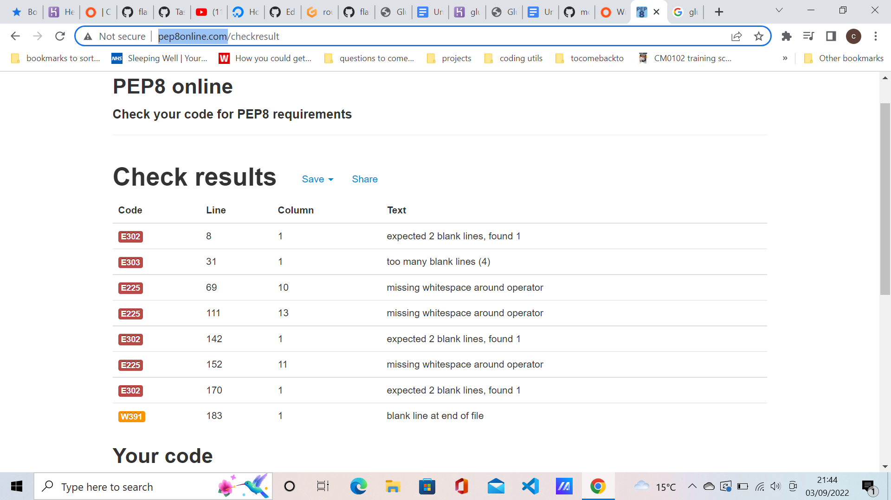
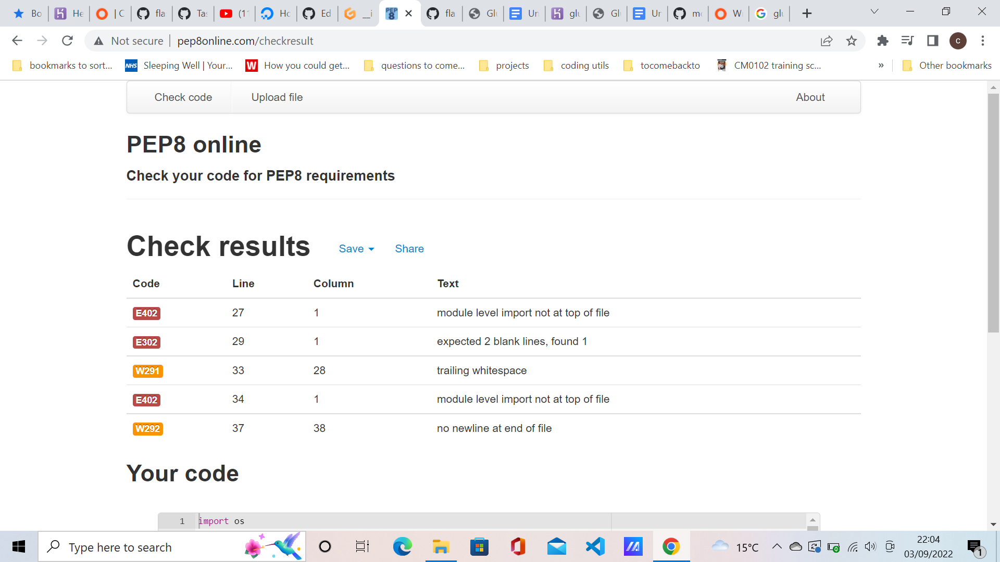
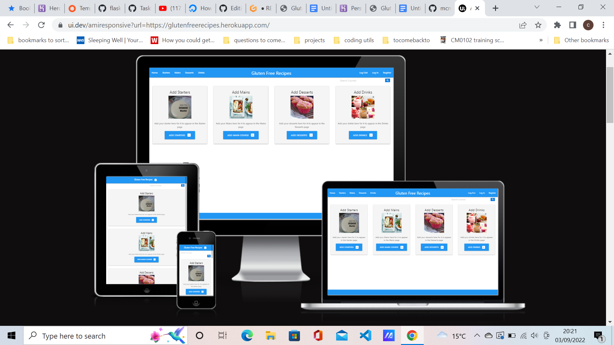

<h1 align="center">Gluten-Free Recipes</h1>

[View live project]

<h2>Overview</h2>

This project, is a Gluten-Free recipe database where you can can enter your recipes on the home page, and they will show on the appropriate pages, i.e Starters , Mains etc.
There is also the option to edit or delete these recipes.
I chose this project because a family member has celiac disease and has to maintian a gluten-free diet. 
I had planned to add a search bar and authentication but time was against me, as I had technical problems with deploying to Heroku, so the Frontend is done but I ran out of time to complete the back-end.


## User Experience

### User stories
As a visitor of the website, I would like the website to be easy to navigate, not bloated like some websites are, and the for the recipes to be easy to write, find and with easy options to edit and delete the recipes. 

## Design
The main colour scheme of the website is blue and white, and recipes in green modals.

## Technologies Used

- HTML
- CSS
- Javascript
- Python
- Flask
- Postgres

## Frameworks, Libraries & Programs Used

 
- [Materialize:](https://materializecss.com/)
 Materialize was used for the styling
- [Font Awesome:](https://fonts.google.com/)
 Font Awesome was used on some pages on the website 
- [Git:](https://git-scm.com/)
 Git was used for the Gitpod terminal to commit to Git and Push to GitHub.
- [GitHub:](https://github.com/)
 GitHub is used to store the projects code after being pushed from Git.
- [Herouko:](https://dashboard.heroku.com/)
  Herouku was used to deploy the project

  ## Testing

  -  The W3C Markup Validator and W3C CSS Validator Services were used to validate every page of the front ednd of the project to ensure there were no syntax errors in the project.

  -   [W3C Markup Validator](https://jigsaw.w3.org/css-validator/#validate_by_input)

  The base, add_starter,cuisine templates failed on the following:
  <h2 align="center"></h2>
  <h2 align="center"></h2>
  <h2 align="center"></h2>
  <h2 align="center"></h2>

  and more can be seen within the Git Commits.

  The CSS page failed: [W3C CSS Validator](https://jigsaw.w3.org/css-validator/#validate_by_input)
<h2 align="center"></h2>

 
The Python Code was checked by: [pep8](http://pep8online.com/)
routes.py failed :
<h2 align="center"></h2>
__init.py__ failed :

<h2 align="center"></h2

I have tested all links, everything works. The things that are not working is registering, Logging in, Logging out because I ran out of time.

Further Testing
This site has been checked on various phones, tablets, a laptop and a desktop.
It has also been tested on Chrome, Firefox and Edge

It has also been test on [amiresponsive](https://ui.dev/amiresponsive)

<h2 align="center"></h2>

## Bugs
Like previously mentioned, register, log in and out function are not working.

## Deployment

- The project was deployed to Heroku using the following steps...

1. In the Gitpod Terminal type pip3 list - which will show which Python packages are  currently    installed in our workspace.
2. Type pip3 freeze --local > requirements.txt - which will freeze the current Python packages into a requirements.txt.
3. Type echo web: python run.py > Procfile in the terminal to create the Procfile required for Heroku.
4. Log into Heroku
5. From the Resources tab on Heroku, search for heroku postgres within the Add-Ons section.
6. Select the Hobby Dev - Free option, and submit.
7. From the Settings tab on Heroku, and click "Reveal Conig Vars"
8. Add the remaining environment variables hidden within our env.py to the Heroku config vars:

    - DATABASE_URL: comes with the postgres add-on above
    - IP: 0.0.0.0
    - PORT: 5000
    - SECRET_KEY: any_secret_key
    - DEBUG: True (only during development)

9.  From the Deploy tab on Heroku, these next steps are for Automatic Deploys using GitHub:

    - Select GitHub for the deployment method.
    - Ensure your GitHub profile name is listed, and then input your repository name.
    - Once Heroku sees your repository, click "Connect".
    - Select the appropriate branch to deploy from (usually main or master).
    - Click "Enable Automatic Deploys".
    - Click "Deploy Branch". (can take a few minutes to build)

10. Click the More dropdown in the top-right corner of Heroku.
11. Select "Run Console", and follow these steps in the console:
    
    - python3
    - from glutenfree import db
    - db.create_all()
    - exit()

12. Everything should be connected and working now, so click the Open App button.

### Forking the GitHub Repository

- By forking the GitHub Repository we make a copy of the original repository on our GitHub account to view and/or make changes without affecting the original repository by using the following steps...
1. Log in to GitHub and locate the [GitHub Repository](https://github.com/)
2. At the top of the Repository (not top of page) just above the "Settings" Button on the menu, locate the "Fork" Button.
3. You should now have a copy of the original repository in your GitHub account.

### Making a Local Clone

1. Log in to GitHub and locate the [GitHub Repository](https://github.com/)
2. Under the repository name, click "Clone or download".
3. To clone the repository using HTTPS, under "Clone with HTTPS", copy the link.
4. Open Git Bash
5. Change the current working directory to the location where you want the cloned directory to be made.
6. Type `git clone`, and then paste the URL you copied in Step 3.
```
$ git clone https://github.com/YOUR-USERNAME/YOUR-REPOSITORY
```
7. Press Enter. Your local clone will be created.

```
$ git clone https://github.com/YOUR-USERNAME/YOUR-REPOSITORY
> Cloning into `CI-Clone`...
> remote: Counting objects: 10, done.
> remote: Compressing objects: 100% (8/8), done.
> remove: Total 10 (delta 1), reused 10 (delta 1)
> Unpacking objects: 100% (10/10), done.
```
Click [Here](https://help.github.com/en/github/creating-cloning-and-archiving-repositories/cloning-a-repository#cloning-a-repository-to-github-desktop) to retrieve pictures for some of the buttons and more detailed explanations of the above process.

### Acknowledgements
-   My Mentor for continuous helpful feedback.
-   Tutor support at Code Institute for their support
-   Images were from a Google Image search for pictures of GlutenFree food


>

