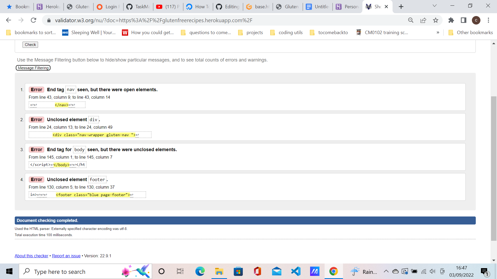

<h1 align="center">Gluten-Free Recipes</h1>

[View live project]

<h2>Overview</h2>

This project, is a Gluten-Free recipe database where you can can enter your recipes on the home page, and they will show on the appropriate pages, i.e Starters , Mains etc.
There is also the option to edit or delete these recipes.
I chose this project because a family member has celiac disease and has to maintian a gluten-free diet. 
I had planned to add a search bar and authentication but time was against me, as I had technical problems with deploying to Heroku, so the Frontend is done but I ran out of time to complete the back-end.

## User Experience

### User stories
As a visitor of the website, I would like the website to be easy to navigate, not bloated like some websites are, and the for the recipes to be easy to find, with easy options to edit and delete the recipes. 

## Design
The main colour scheme of the website is blue and white, and recipes in green modals.

## Technologies Used

- HTML
- CSS
- Javascript
- Python
- Flask
- Postgresl

## Frameworks, Libraries & Programs Used

 
- [Materialize:](https://materializecss.com/)
 Materialize was used for the styling
- [Font Awesome:](https://fonts.google.com/)
 Font Awesome was used on some pages on the website 
- [Git:](https://git-scm.com/)
 Git was used for the Gitpod terminal to commit to Git and Push to GitHub.
- [GitHub:](https://github.com/)
 GitHub is used to store the projects code after being pushed from Git.
- [Herouko:](https://dashboard.heroku.com/)
  Herouku was used to deploy the project

  ## Testing

  -  The W3C Markup Validator and W3C CSS Validator Services were used to validate every page of the front ednd of the project to ensure there were no syntax errors in the project.

  -   [W3C Markup Validator](https://jigsaw.w3.org/css-validator/#validate_by_input)

  The base, add_starter,cuisine templates failed on the following:
  <h2 align="center"></h2>
  <h2 align="center"></h2>
  <h2 align="center"></h2>
  <h2 align="center"></h2>

  and more can be seen within the Git Commits.

  The CSS page failed: [W3C CSS Validator](https://jigsaw.w3.org/css-validator/#validate_by_input)
<h2 align="center"></h2>

 
The Python Code passed: [online-ide.com](https://www.online-ide.com/online_python_syntax_checker)

I have tested all links, everything works. The things that is not working is registering, Logging in, Logging out because I ran out of time.

Further Testing
This game has been checked on various phones, tablets, a laptop and a desktop.

>

